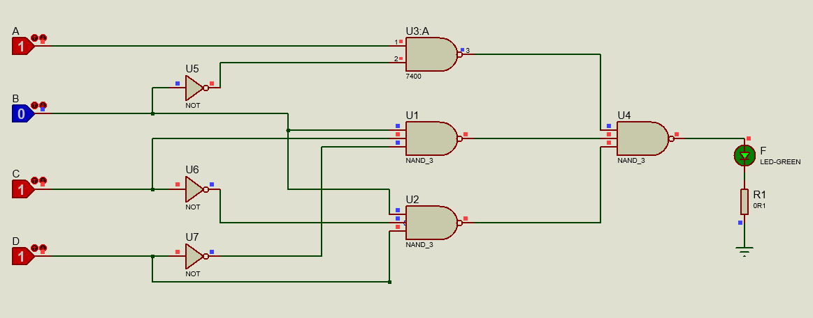

# Design Example

## Question
Design a combinational circuit with four inputs— A, B, C, and D —and one output, F . F
is to be equal to 1 when A = 1, provided that B = 0, or when B = 1, provided that
either C or D is also equal to 1. Otherwise, the output is to be equal to 0.
 1. Obtain the truth table of the circuit.
 2. Simplify the output function.
 3. Draw the logic diagram of the circuit, using NAND gates with a minimum number
of ICs.
 4. Construct the circuit and test it for proper operation by verifying the given
conditions. 

## Answer
The answers of parts 1 to 3 are in the **[Document file](Document.pdf)**.
The circuit of part 4 are in the **[Proteus file](DesignExample.pdsprj)**.

### Proteus circuit
