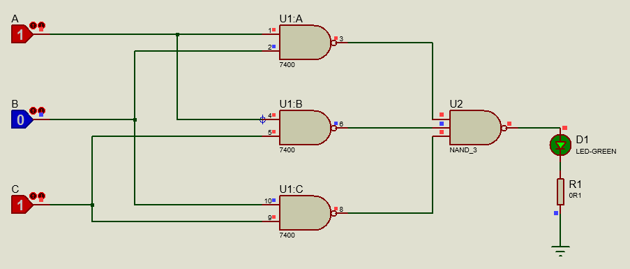

# MajorityLogic

## Question
 A majority logic is a digital circuit whose output is equal to 1 if the majority of the inputs
are 1’s. The output is 0 otherwise. Design and test a three‐input majority circuit using
NAND gates with a minimum number of ICs. 

## Answer
Truth table, Karnaugh map, simplofy and implementation with NAND gates in the **[Document file](Document.pdf)**.
The circuit are in the **[Proteus file](MajorityLogic.pdsprj)**.

### Proteus circuit

