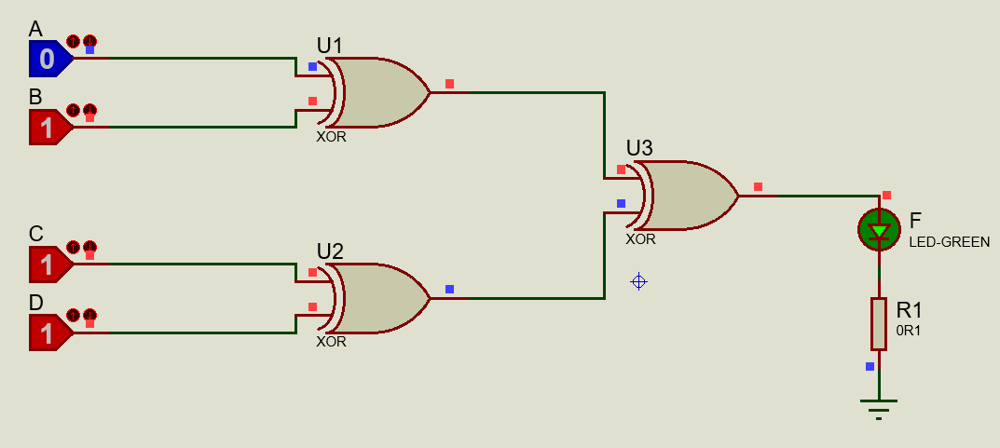

# ParityGenerator

## Question
 Design, construct, and test a circuit that generates an even parity bit from four message
bits. Use XOR gates. Adding one more XOR gate, expand the circuit so that it generates
an odd parity bit also. 

## Answer
Truth table, Karnaugh map, simplify, implementation with Xor gates and other information in the **[Document file](Document.pdf)**.
The circuits Proteus files are in the **[simple circuit](ParityGenerator_Simple.pdsprj)** and **[expanded circuit](ParityGenerator_Expanded.pdsprj)**.

### Proteus simple circuit

### Proteus expanded circuit

