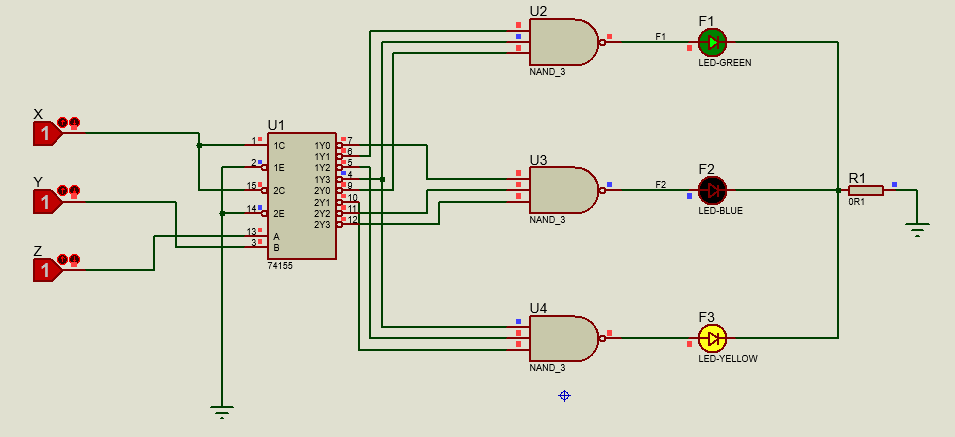

# DecoderImplementation

## Question
 A combinational circuit has three inputs x, y, and z and three outputs F1, F2, and
F3. The simplified Boolean functions for the circuit are:
1. F1 = xz + x!y!z!
2. F2 = x!y + xy!z!
3. F3 = xy + x!y!z

Implement and test the combinational circuit, using a 74155 decoder IC and external
NAND gates.

## Answer
Truth table, implementation with NAND gates and other information in the **[Document file](Document.pdf)**.
The circuit are in the **[Proteus files](DecoderImplementation.pdsprj)**.

### Proteus circuit

