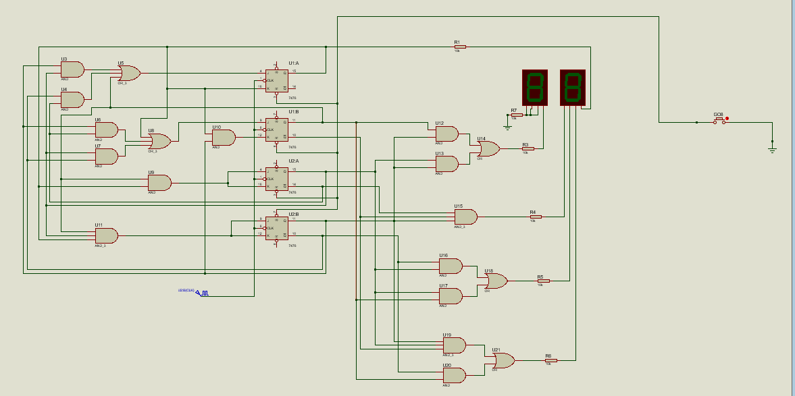
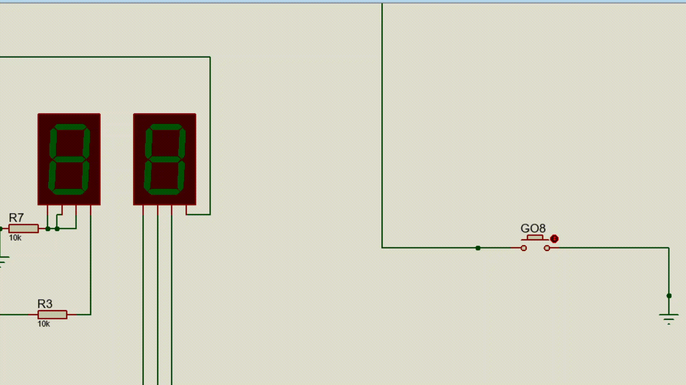

# UnusualCounter (**Optional**)

**This is an optional exercise.**

## Question
 Design, construct, and test a counter that goes through the following sequence of binary
states: 0, 1, 2, 3, 6, 7, 10, 11, 12, 13, 14, 15, and back to 0 to repeat. Note that binary states
4, 5, 8, and 9 are not used. The counter must be self‐starting; that is, if the circuit starts
from any one of the four invalid states, the count pulses must transfer the circuit to one
of the valid states to continue the count correctly.

## Answer
State Diagram, State Table, Karnaugh maps and other necessary information in the **[Document file](Document.pdf)**.
The circuit are in the **[Proteus files](UnusualCounter.pdsprj)**.

### Proteus circuit

